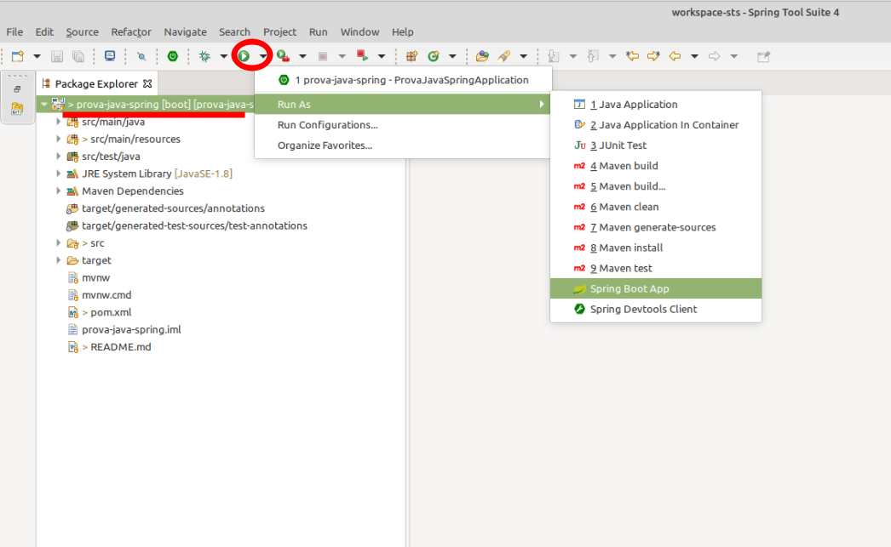

# Prova Java Spring IST - Configuração

O desenvolvimento da prova consiste em desenvolver telas(s) conforme especificado, em protótipos enviados por e-mail.

O projeto da prova utiliza a linguagem JAVA e o framework Spring (DI, JPA, JSF, MVC, etc).

Alguns pontos em relação ao desenvolvimento:
- Fique a vontade para adicionar mais libs, caso ache necessário. No entanto, essas devem ser adicionada ao projeto via maven (no arquivo pom.xml)
- A criação das tabelas, no banco de dados, são de forma automática, dependendo do que está modelado nas entidades.
- Os arquivos de exemplos estão organizados de forma adequada (MVC).
- Descreva ao final deste documento (Readme.md) o detalhamento de funcionalidades implementadas, sejam elas já descritas na modelagem e / ou extras.
- Detalhar também as funcionalidades que não conseguiu implementar e o motivo.
- Caso tenha adicionado novas libs, descreva quais foram e porque dessa agregação.
- As alterações realizadas na prova deve ser comitada diretamente na master/main do repositório, e não deve estar zipado.
- Caso ocorrer algum problema ao utilizar o banco no docker, pode-se utilizar sem o docker.

No mais, desenvolva com qualidade e boa prova :)
## Versão JDK

Utilizar a versão mais recente.

## Download da IDE

Baixar e descompactar o Spring Tools 4 for Eclipse (STS):

- [Windows][sts-windows]
- [Linux][sts-linux]
- [Mac][sts-mac]

Iniciar o STS escolhendo uma worksplace de sua preferência.

## Clone do repositório do projeto

Clonar esse repositório dentro da pasta do workspace utilizado no STS.

## Clone do repositório do banco de dados

Instalar o docker: https://www.docker.com/get-started > Docker Desktop

O banco de dados é criado via docker e o fonte está disponível em https://github.com/CETEC-DIGI/prova-java-remoto-banco

Após o clone, ir via terminal na pasta extraida e executar o banco pelo docker: `docker-compose up -d`

OBS: Se atentar que não pode haver nenhum servidor postgres rodando na máquina, se tiver, necessário fechar todos os serviços, assim como
qualquer outro serviço que esteja utilizando a porta 5432. Para verificar se o docker subiu corretamente, realizar a conexão com o banco:
- host: localhost
- port: 5432
- database: ist
- user: ist
- password: ist

## Configuração da IDE

- O Projeto está configurado para utilização do [Lombok][lombok], porém fique a vontade para usar ou não. Para configurá-lo na IDE clique em [Lombok][lombok].

- Ir em "File > Import..." e escolher a opção conforme segue:

  

- Selecionar a pasta do projeto e confirmar como segue:

  

- Em *Select root repository* escolher a pasta do projeto e clicar em *Finish*.

## Subindo a aplicação

- Selecionar o projeto:
- No combo do botão run circulado na imagem abaixo, escolher a opção Run As e depois Spring Boot App.

  

- No navegador digitar http://localhost:8080/, irá mostrar uma tela inicial conforme abaixo:

  

[sts-windows]: https://download.springsource.com/release/STS4/4.11.0.RELEASE/dist/e4.20/spring-tool-suite-4-4.11.0.RELEASE-e4.20.0-win32.win32.x86_64.self-extracting.jar

[sts-linux]: https://download.springsource.com/release/STS4/4.11.0.RELEASE/dist/e4.20/spring-tool-suite-4-4.11.0.RELEASE-e4.20.0-linux.gtk.x86_64.tar.gz

[sts-mac]: https://download.springsource.com/release/STS4/4.11.0.RELEASE/dist/e4.20/spring-tool-suite-4-4.11.0.RELEASE-e4.20.0-macosx.cocoa.x86_64.dmg

[lombok]: https://projectlombok.org/setup/eclipse

# Detalhamento as funcionalidades implementadas

## Models:

#### User (Pessoa):

Foi implementada a entidade user (Pessoa) com as seguintes propriedadas: Long id (chave primária e gerado automaticamente), String name (não podendo ser vazio), String email (não podendo ser vazio, necessita seguir padrão de um email e deve ser único), String address (não podendo ser vazio), String cpf (não podendo ser vazio e deve ser únido) .

#### Account (Conta):

Foi implementada a entidade account (Conta) com as seguintes propriedades: Long id (chave primária e gerado automaticamente), Integer registrationCode (número de registro da conta, não podendo ser nulo e que deve ser único), User user (usuário relacionado à conta, podendo ter várias contas com o mesmo usuário e não podendo ser nulo) e BigDecimal balance (saldo que é obtido ao fazer uma busca por conta, detalhe que ele não se torna uma coluna no banco).

#### Transaction (Movimentação):

Foi implementada a entidade transaction (Movimentação) com as seguintes propriedades: Long id (chave primária e gerado automaticamente), Account account (conta relacionada à movimentação, podendo ter várias movimentações na mesma conta, não podendo ser nula), BigDecimal value (valor referente à movimentação, não podendo ser nulo) e LocalDateTime dateTime (data e hora da movimentação criada autmaticamente pelo metódo PrePersist).

## DTOs: 

### Account:

Foi implementado um DTO (Data Transfer Object) para envio de dados da entidade account (Conta) com as seguintes propriedades: id, registrationCode, user e balance. Esse DTO possui um construtor 
